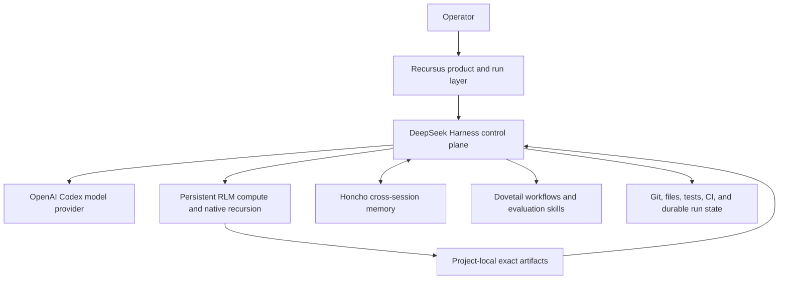

# Recursus

**A durable, full-access runtime agent that can remember, compute, delegate, resume, verify, and finish.**

Recursus is the product and assembly layer for an OpenCnid agent runtime built on DeepSeek Harness. DeepSeek Harness remains the control plane: it owns the agent loop, sessions, tools, approvals, policy, lineage, cancellation, and telemetry. Recursus composes independently versioned capabilities around that core and will add durable run state, execution supervision, verification-driven completion, coordinated delegation, bounded context compilation, and adaptive model routing.

> [!IMPORTANT]
> Recursus is at the foundation stage. The component integrations are real and independently verified, but the unified installer and durable-run packages described in the roadmap have not been released yet. This repository must not claim an assembled production release before its acceptance gates pass.

Recursus intentionally runs with the host access granted by its operator. It is designed as a capable agent on a trusted development machine, not as a security sandbox. Irreversible external actions still require explicit gates, exact targets, and durable evidence.

## Runtime composition



| Component | Responsibility | Repository |
| --- | --- | --- |
| DeepSeek Harness | Agent loop, tools, sessions, policy, lineage, cancellation, UI | [`OpenCnid/deepseek-harness`](https://github.com/OpenCnid/deepseek-harness) |
| OpenAI Codex adapter | ChatGPT-subscription model provider | [`OpenCnid/deepseek-openai-codex`](https://github.com/OpenCnid/deepseek-openai-codex) |
| DeepSeek RLM | Persistent IPython, snapshots, recursive DSH children, Python tool bridge | [`OpenCnid/deepseek-rlm`](https://github.com/OpenCnid/deepseek-rlm) |
| DeepSeek Honcho | Cross-session memory, exact artifacts, sanitized experiment cards | [`OpenCnid/deepseek-honcho`](https://github.com/OpenCnid/deepseek-honcho) |
| DeepSeek Dovetail | Prompting, delegation, evaluation, self-play, steering, and handoff workflows | [`OpenCnid/deepseek-dovetail`](https://github.com/OpenCnid/deepseek-dovetail) |

Exact revisions and license boundaries are recorded in [`manifests/components.json`](./manifests/components.json) and [`THIRD_PARTY_NOTICES.md`](./THIRD_PARTY_NOTICES.md).

## What Recursus will own

- a reproducible, one-command runtime assembly;
- authoritative durable task and run state;
- persistent process, kernel, CI, and wakeup supervision;
- machine-readable completion contracts;
- dependency-aware multi-agent coordination;
- bounded context compilation with trust and freshness labels;
- model, reasoning-effort, and RLM routing;
- operator status, pause, resume, cancel, and approval controls;
- end-to-end compatibility, packaging, evaluation, and releases.

## What Recursus will not own

- a second agent loop beside DSH;
- another transcript store or general memory system;
- current-code truth inside Honcho;
- artifact bytes inside Honcho;
- hidden relicensing or copied component histories;
- claims of official endorsement by any upstream project.

## Standing on the shoulders of giants

Recursus exists because many projects made the hard parts legible and reusable. We are especially grateful to:

- DeepSeek AI and the DeepSeek Harness contributors for the plugin-first agent control plane;
- the Cordis and associated framework contributors for spatiotemporal service composition;
- OpenAI and the Codex ecosystem for the model experience used through our provider adapter;
- Mario Zechner, the Pi ecosystem, and `@earendil-works/pi-ai` contributors for the direct provider and OAuth substrate;
- the Prime Agent contributors for persistent-kernel and recursive-agent techniques adapted by DeepSeek RLM;
- Project Jupyter and IPython for the computational substrate;
- Honcho and Plastic Labs for cross-session reasoning and the official Honcho SDK;
- Matthew Murphy, Lexideck, the SPARK authors, and all OpenCnid Dovetail contributors whose methods inform the workflow layer;
- every maintainer of the libraries and tools recorded in the component lockfiles and notices.

Credit is not a license substitution. Each dependency and component retains its own copyright and terms. See [`THIRD_PARTY_NOTICES.md`](./THIRD_PARTY_NOTICES.md).

## Roadmap

The implementation order is defined in [`GAMEPLAN.md`](./GAMEPLAN.md):

1. reproducible runtime assembly;
2. durable run state;
3. execution supervision;
4. verification-driven completion;
5. coordinated delegation;
6. bounded context compilation;
7. adaptive model and compute routing;
8. operator experience, evaluation, and release.

The normative product boundaries and Definition of Done are in [`SPEC.md`](./SPEC.md). The component topology is explained in [`docs/ARCHITECTURE.md`](./docs/ARCHITECTURE.md).

To continue implementation in a fresh Codex session, use the maintained kickoff in [`NEXT_SESSION_PROMPT.md`](./NEXT_SESSION_PROMPT.md). It directs the session to the normative specification and the first unfinished milestone.

## Foundation verification

The initial repository has no runtime dependency installation. Verify its pinned component manifest, required documents, MIT boundary, and attribution closure with:

```sh
node scripts/verify.mjs
```

## License

Original Recursus code and documentation are licensed under the [MIT License](./LICENSE). Referenced and later assembled components retain their own licenses. Recursus is an independent OpenCnid project and is not an official DeepSeek, OpenAI, Honcho, or Prime product.
